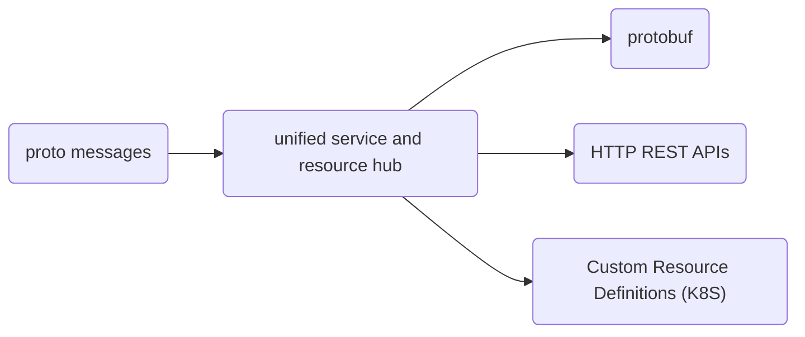

# aepc

Generates AEP-compliant RPCs from proto messages. See the main README.md for usage.

## Purpose

aepc is designed to primarily work off of a resource model: rather than having individual RPCs / methods on a resource, the user declares *resources* that live under a *service*. The common operations against a resource (Create, Read, Update, List, and Delete) are generatable based on the desired control plane standard, such as the AEP standard or custom resource definitions for the Kubernetes Resource Model.

## Design

aepc works off of an internal "hub" representation of a resource, while each of the consumers and producers is a "spoke", using the resource information for generation of service, clients, or documentation:

