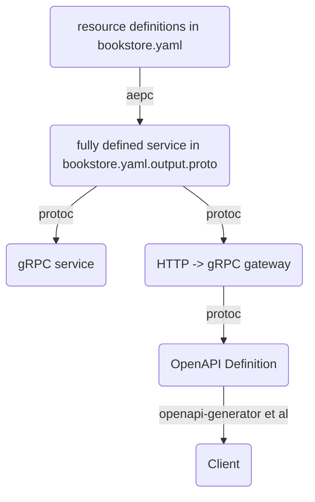

# Example AEPC service

This directory contains an example of how to use aepc to generate an
AEP-compliant protobuf API, including built-in HTTP bindings.

## Running

To start the service, running the following from the root directory:

```bash
go run example/main.go
```

## Architecture

